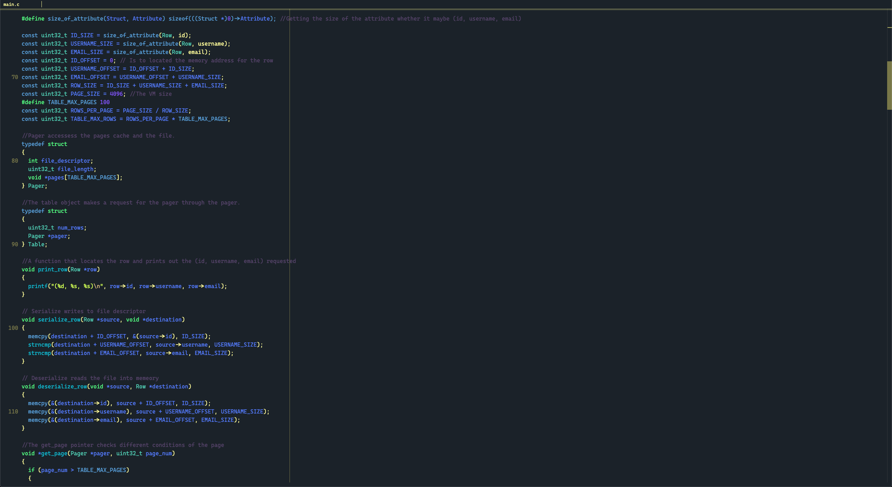

# CodingInSylens-Theme

CodingInSylens is an unique chilled theme with subtle colors, built for Visual Studio Code.

<h3>Personalization<h3>

 If you want more 
  <strong> Customization </strong> download  
  <strong> CustomizeUI </strong> 
  from visual studio code extension 
  

<pre> <code>"customizeUI.font.monospace": "Cascadia Code",
  "customizeUI.font.regular": "Cascadia Code",
  "customizeUI.fontSizeMap": {
    "13px": "13px",
    "monospace": "13px"
  },
  "customizeUI.stylesheet": {
    ".tabs-container .tab": "height: 18px !important",
    ".tabs": "height: 22px !important",
    "[aria-label='Editor actions']": "display: none !important;",
  }, 
  </code> 
  </pre>
  
 <h2> License <h2>
<a href="https://github.com/Sylenss/CodingInSylens-Theme"> Christina Clayton </a>
