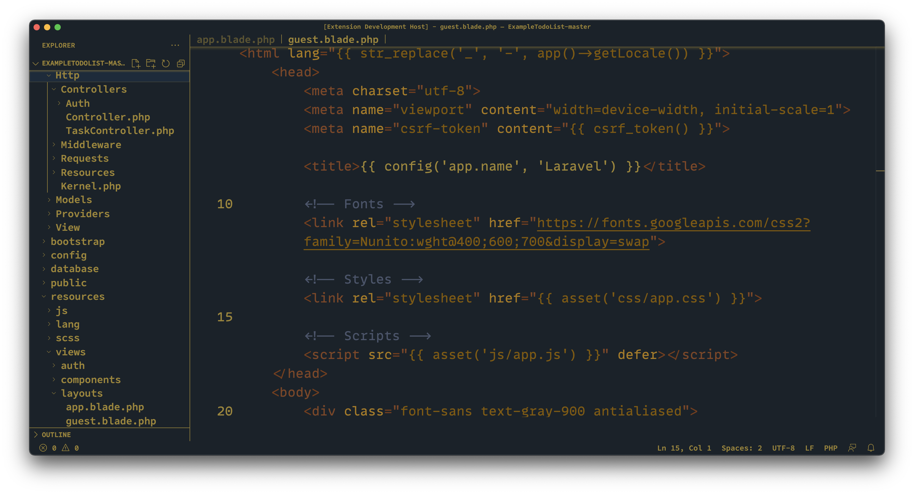
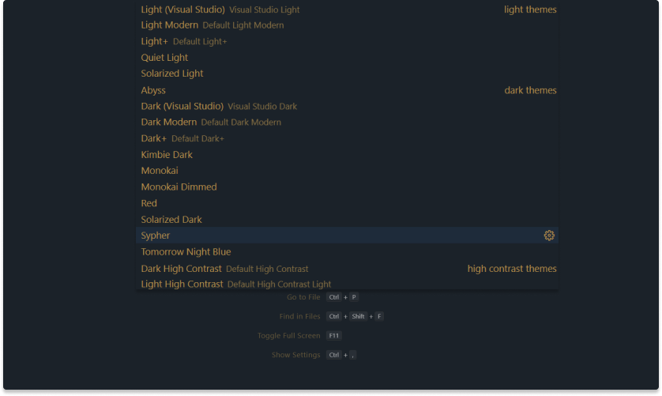
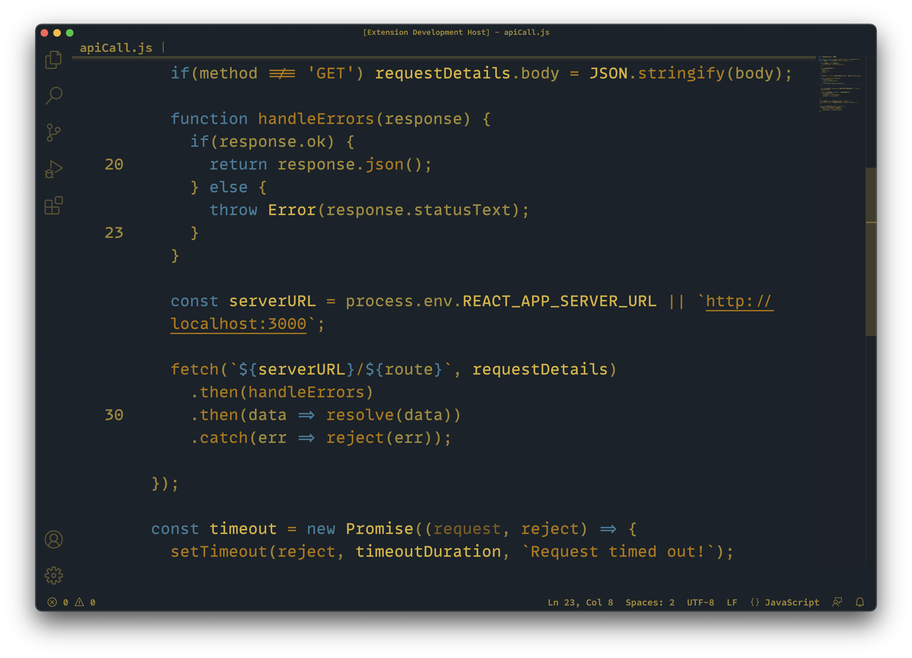
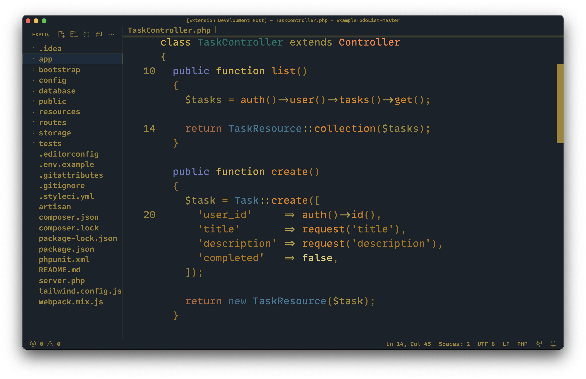
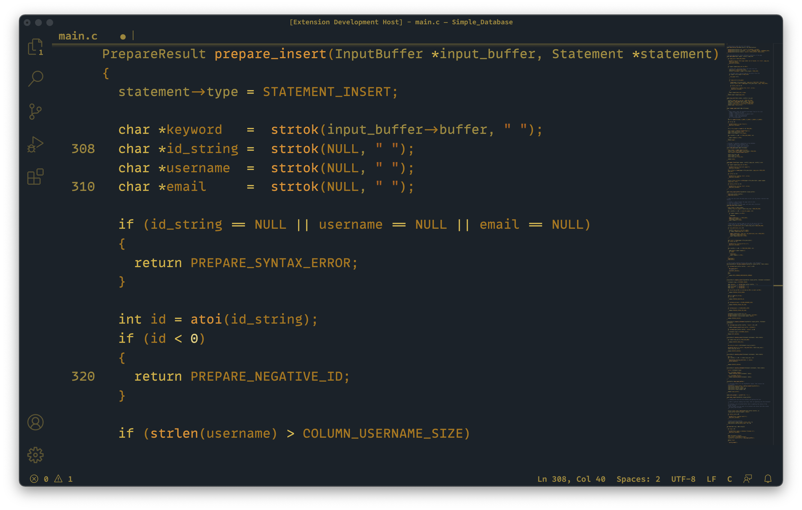

    <picture>
      <source srcset="/assets/Sypher-Icon.png" width="100%" media="(prefers-color-scheme: light)" />
      <source srcset="/assets/Sypher-Icon.png" width="100%" media="(prefers-color-scheme: dark)" />
      
    </picture>

 A militaristic color <a href="https://code.visualstudio.com" target="_blank">Visual Studio Code</a> theme.

 Designed for a seamless and lucid workflow.

 

### Quick Start

Thanks to the official [VS Code Extension Marketplace][vscode-extmarket-home], _Sypher Visual Studio Code_ can be installed with one click.

Open the <a href="https://code.visualstudio.com/docs/editor/extension-gallery" rel="nofollow">extension marketplace</a> by clicking on the <em> Extension</em> icon in the<a href="https://code.visualstudio.com/docs/getstarted/userinterface#_activity-bar" rel="nofollow"> <em>Activity Bar</em></a>. Search for `Sypher` and click on the <kbd>Install</kbd> button.

#### Activation

To activate the theme click on the gear icon in the _Activity Bar_ and select _Color Theme_. Search for `Sypher` and confirm the color theme change with <kbd>Enter</kbd>.

  <picture>
    
  </picture>

## Features

 <strong>Decipher your brain power, to unleash your creativity.</strong> 

 A harmonized UI and syntax element schema ensures an unobstructed and fluidly coalescing aesthetic.

 

 <strong> Intelligently structured code for enhanced concentration. </strong> 

 The editor's color scheme accommodates numerous programming languages, ranging from built-in definitions to various popular third-party syntax extensions.

 

 <strong> Conceptualize a dream within a dream, envisioned into a colorscheme. </strong>

 Syntax highlighting is different depending on the programming language of your choice.

 

  Copyright © 2024-present <a href="https://www.sylens.dev" rel="nofollow">Christina Clayton</a>

    
    

